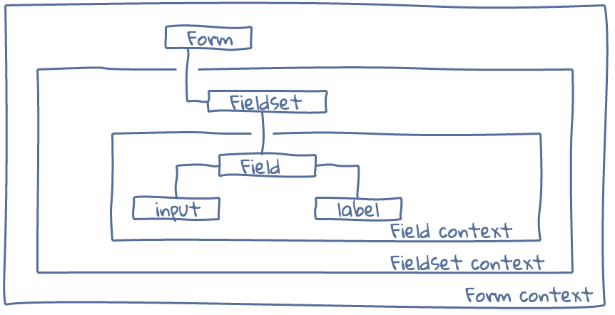

Overview
========

There are three central concepts in React Forms — form schemas, form components
and input components.

Form Schemas
------------

Form schemas are high level declarative descriptions of how forms should
operate: what's shape of the data form should handle, how to render any specific
field, how to validate user input and so on.

Form schemas don't do anything by themselves they are just metadata and are
subject to interpretation by form components (see :ref:`form-components`) of React Forms library.

A basic example of a form schema looks like::

  function Person(props) {
    props = props || {}
    return (
      <Schema name={props.name} label={props.label}>
        <Property name="first" label="First name" />
        <Property name="last" label="Last name" />
      </Schema>
    )
  }

  var family = (
    <Schema>
      <Person name="mother" label="Mother" />
      <Person name="father" label="Father" />
      <List name="children">
        <Person />
      </List>
    </Schema>
  )

.. note::
  :class: inline

  The example uses JSX syntax to describe schema (similar to how React uses JSX
  to describe UI) but it's not required.

You can read more about schemas on :doc:`schema` documentation page.

.. _form-components:

Form Components
---------------

Form components are React components which interpret form schemas to render
form UI and handle validation and data flow. They are designed to be as generic
as possible and so to be reusable across as many form schemas as possible.

There are four types of form components, each for different schema type and one
component which serves as a form controller: ``<Form />``, ``<Field />``,
``<Fieldset />`` and ``<RepeatingFieldset />``.

The functional scope of form components is to decide where to render ``<label
/>`` elements, when to show hide any specific field, how to handle array values
and so on. What falls outside of this is how users enter form values, this is
handled by input components (see :ref:`input-components`) instead.

<Form />
~~~~~~~~

``<Form />`` component is the only stateful component provided by React Forms.
It serves as a form controller, holds form value and validation state and
updates it accordingly.

Every change made by user through an input component is propagated up to the
form component.

<Field />
~~~~~~~~~

``<Field />`` component is used to represent scalar values (strings, numbers,
dates and so on), values which correspond to schema nodes of type ``Property``.

This component renders input component and corresponding ``<label>`` component
with field label and hint text.

<Fieldset />
~~~~~~~~~~~~

``<Fieldset />`` component is used to render objects, values which correspond to
schema nodes of type ``Schema``.

<RepeatingFieldset />
~~~~~~~~~~~~~~~~~~~~~

<RepeatingFieldset /> is used to render values which corresponds to ``List``
schema nodes.

It renders a form component for each item in a value and also provides controls
to create a new item and to remove existent items.

.. _input-components:

Input Components
----------------

Input components are React components which handle user input of form values.
At a basic level these are ``<input />`` components. But one can develop custom
ones as datepickers, WYSIWYG editors and so on. Technically input components are
reusable outside of React Forms context and are typical components which conform
to "value/onChange" contract.

Dataflow
--------

``Form`` component "holds" entire form value and validation state as its state.
This is the only stateful component in React Forms. It uses React context
mechanism to expose value and validation state for components down in a
hierarchy.

Each of form elements (fields, fieldsets, repeating fieldsets) can access form
value and validation state through context. But some of the elements like
fieldset and repeating fieldsets provide their own context by projecting only a
relevant part of the parent's context.

The resulted component hierarchy looks like.

When user interacts with the form through the input component the corresponding
form element **creates a new copy** of form value and validation state and
notifies form via callback (also exposed via context).

Thus React Forms guarantees that the entire form state is accessible from a
single location and is immutable. That enables such complex functionality as
undo/redo to be implemented in about 50 LOC, see the
:doc:`examples/undo-example`.
